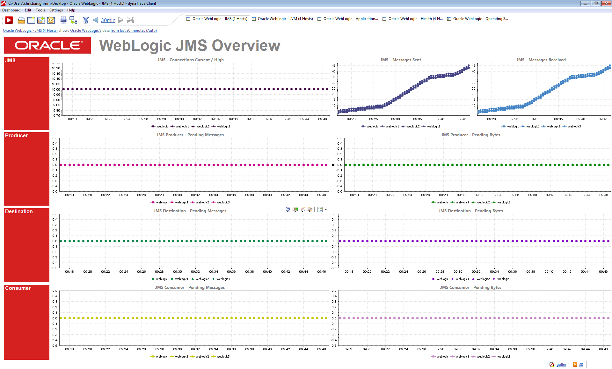
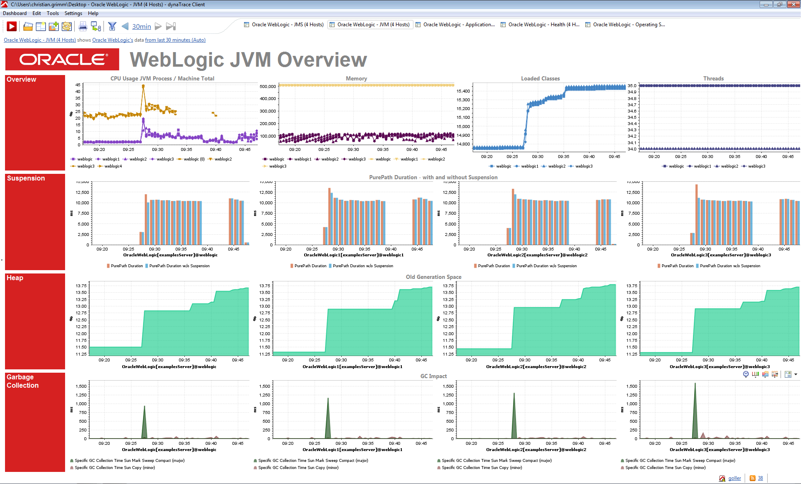
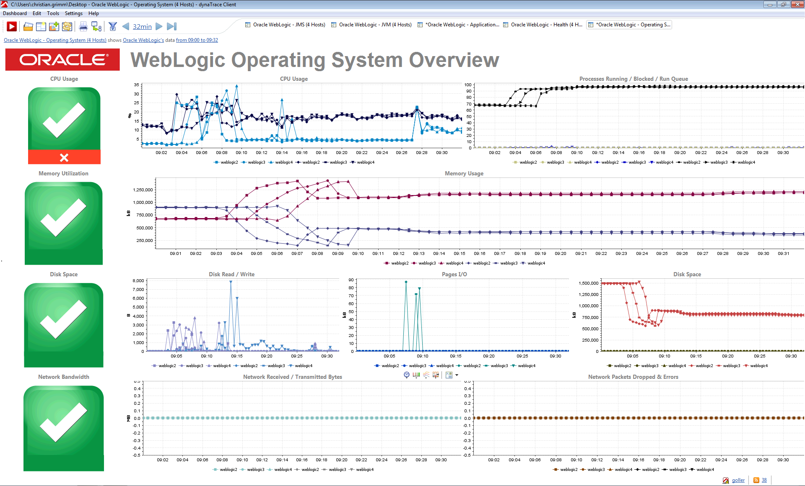

<html xmlns="http://www.w3.org/1999/xhtml">
<head>
    <title>Oracle WebLogic FastPack</title>
    <meta http-equiv="Content-Type" content="text/html; charset=UTF-8"/>
    <meta http-equiv="X-UA-Compatible" content="IE=EmulateIE8" />
    <meta content="Scroll Wiki Publisher" name="generator"/>
    <link type="text/css" rel="stylesheet" href="css/blueprint/liquid.css" media="screen, projection"/>
    <link type="text/css" rel="stylesheet" href="css/blueprint/print.css" media="print"/>
    <link type="text/css" rel="stylesheet" href="css/content-style.css" media="screen, projection, print"/>
    <link type="text/css" rel="stylesheet" href="css/screen.css" media="screen, projection"/>
    <link type="text/css" rel="stylesheet" href="css/print.css" media="print"/>
</head>
<body>
                <h1>Oracle WebLogic FastPack</h1>
    

        <h2>Overview</h2>
    

            
            

    

    

    

The dynaTrace FastPack for Oracle WebLogic 11g+ enables deep insight into the Oracle WebLogic Application Server and the enclosing platform. This FastPack provides essential metrics which are visualized on different dashboards.    

    

The FastPack was developed in close co-operation with the Swiss dynaTrace customer BIT (Federal Office of Information Technology and Telecommunication). Special thanks to Sascha Koerner for sharing his production monitoring know-how and supporting the dynaTrace Community.    

    

            
            

    

    

        <h2>Fast Pack Details</h2>
    

        <table>
<thead class=" "></thead><tfoot class=" "></tfoot><tbody class=" ">    <tr>
            <td rowspan="1" colspan="1">
        

Author    

            </td>
                <td rowspan="1" colspan="1">
        

Christian Grimm (christian.grimm@dynatrace.com)    

            </td>
        </tr>
    <tr>
            <td rowspan="1" colspan="1">
        

dynaTrace Versions    

            </td>
                <td rowspan="1" colspan="1">
        

dynaTrace 4.1 dynaTrace 3.5    

            </td>
        </tr>
    <tr>
            <td rowspan="1" colspan="1">
        

License    

            </td>
                <td rowspan="1" colspan="1">
        

<a href="attachments_5275722_2_dynaTraceBSD.txt">dynaTrace BSD</a>    

            </td>
        </tr>
    <tr>
            <td rowspan="1" colspan="1">
        

Support    

            </td>
                <td rowspan="1" colspan="1">
        

<a href="https://community/display/DL/Support+Levels">Not Supported</a>    

            </td>
        </tr>
    <tr>
            <td rowspan="1" colspan="1">
        

Known Problems    

            </td>
                <td rowspan="1" colspan="1">
        

Some features are currently only available on UNIX platforms (*only the UNIX Monitoring Plugin is currently used to provide OS metrics)    

            </td>
        </tr>
    <tr>
            <td rowspan="1" colspan="1">
        

Release History    

            </td>
                <td rowspan="1" colspan="1">
        

2011-04-11 Initial Release 2011-04-19 Optimized Dashboards added 2011-04-27 Added JRockit / Sun JVM Memory Diagnostics Dashboards 2012-01-16 Added FastPack for dynaTrace 4.1    

            </td>
        </tr>
    <tr>
            <td rowspan="1" colspan="1">
        

FastPack Contents    

            </td>
                <td rowspan="1" colspan="1">
        

1 System Profile 1 Plugin 7 Dashboards    

            </td>
        </tr>
    <tr>
            <td rowspan="1" colspan="1">
        

Download    

            </td>
                <td rowspan="1" colspan="1">
        

dynaTrace 4.1: <a href="attachments_70516738_1_dynaTrace_Oracle_WebLogic_FastPack-4.1.dtp">dynaTrace Oracle WebLogic FastPack</a> (Please rename to .dtp if the file is downloaded as .zip) <a href="attachments_47972389_1_Optimized_Oracle_WebLogic_Dashboards.zip">Optimized dynaTrace Oracle WebLogic Dashboards</a> (optimized for displaying up to four WebLogic instances on one Dashboard)  dynaTrace 3.5: <a href="attachments_47611949_1_com.dynatrace.weblogic.extended_1.0.0.0.jar">dynaTrace Oracle WebLogic Extended Metrics Plugin</a> <a href="attachments_47972468_1_dynaTrace_Oracle_WebLogic_FastPack.dtp">dynaTrace Oracle WebLogic FastPack</a> (Please rename to .dtp if the file is downloaded as .zip) <a href="attachments_47972389_1_Optimized_Oracle_WebLogic_Dashboards.zip">Optimized dynaTrace Oracle WebLogic Dashboards</a> (optimized for displaying up to four WebLogic instances on one Dashboard)    

            </td>
        </tr>
    <tr>
            <td rowspan="1" colspan="1">
        

Documentation    

            </td>
                <td rowspan="1" colspan="1">
        

<a href="attachments_47972353_1_FastPack_Documentation_(German).pdf">FastPack Documentation (German).pdf</a>    

            </td>
        </tr>
</tbody>        </table>
            

    

    

        <h2>Content</h2>
    

The following components are part of this FastPack:    

    

        <h3>WebLogic System Profile</h3>
    

The reference System Profile contains a set of basic metrics required by the Dashboards of this FastPack. In addition, the UNIX Monitor Plugin and the Web Transaction Monitor Plugin are used to fetch additional metrics.    

    

    

        <h3>WebLogic Extended Plugin</h3>
    

The &quot;WebLogic Extended&quot; plugin is an essential part of this FastPack. This Plugin is a metric group plugin which retrieves additional JMX values from the Oracle WebLogic Application Server. The Plugin has to be manually installed before the FastPack can be used.    

    

    

        <h3>WebLogic Application Dashboard</h3>
    

            
            

    

The Application Dashboard gives a quick overview of the following metrics:    

<ul class=" "><li class=" ">    

Synthetic Web Transaction (*needs to be configured in the System Profile settings)    

</li><li class=" ">    

API Layer Breakdown (gives a quick overview of the most time consuming application layers)    

</li><li class=" ">    

Transactions (How many Transactions are currently processed by the WebLogic Application Server and how is the Response Time)    

</li><li class=" ">    

Database (Quantity of Database operations and time spent on DB layer)    

</li></ul>    

    

        <h3>WebLogic Health Dashboard</h3>
    

            
            

    

The WebLogic Health Dashboard gives insight into the Oracle WebLogic Application server's internal metrics.    

<ul class=" "><li class=" ">    

Sessions (Current Web Sessions and the configured Servlet Pool Size)    

</li><li class=" ">    

JTA (Active Transactions. Additional graph for committed and abandoned Transactions)    

</li><li class=" ">    

EJB (EJB Cache Miss Count in relation to the total EJB Access Count. Second graph for committed, rolled back and timed out EJB Transactions)    

</li><li class=" ">    

JDBC (Current JDBC Connection Count in relation to the JDBC Connection Count High Count. Second graph shows the current JDBC Connections Delay)    

</li><li class=" ">    

Execution Queue (Current number of pending requests in the Execution Queue. Additional metrics for the Execution Queue Threads)    

</li><li class=" ">    

CPU / Thread (CPU usage of the WebLogic process. Additional threading infos)    

</li></ul>    

    

        <h3>WebLogic JMS Dashboard</h3>
    

            
            

    

The JMS Dashboard gives insight into the messaging subsystem of the Oracle WebLogic Application Server.    

<ul class=" "><li class=" ">    

JMS (Current JMS Connections in relation to the highest number of parallel JMS Connections. Second graphs for total sent and received JMS Messages)    

</li><li class=" ">    

Producer (Pending JMS Messages)    

</li><li class=" ">    

Destination (Pending JMS Messages)    

</li><li class=" ">    

Consumer (Pending JMS Messages)    

</li></ul>    

    

        <h3>WebLogic Operating System Dashboard</h3>
    

            
            

    

The Operating System Dashboard displays important information about the machine's performance metrics.    

<ul class=" "><li class=" ">    

CPU Usage (Current CPU Usage)    

</li><li class=" ">    

Processes (Number of Blocked / Run Queue Current processes in relation to total process count)    

</li><li class=" ">    

Memory (Used and Free Memory)    

</li><li class=" ">    

Disk I/O (Current Disk activity)    

</li><li class=" ">    

Pages I/O (Paging activity)    

</li><li class=" ">    

Disk Space (Used Disk Space in relation to the Total Disk Space)    

</li><li class=" ">    

Network (Network Activity and Errors)    

</li></ul>    

    

        <h3>WebLogic JVM Overview Dashboard</h3>
    

            
            

    

The JVM Dashboard provides some basic metrics for monitoring the Java Virtual Machine.    

<ul class=" "><li class=" ">    

Overview (CPU Usage of the JVM process in relation to the machine's total CPU Usage. Additional metrics for Memory Usage, currently Loaded Classes and number of Threads)    

</li><li class=" ">    

Suspension (Displays the current PurePath durations with and without Runtime Suspensions)    

</li><li class=" ">    

Heap (Shows the Old Generation Space in percent)    

</li><li class=" ">    

Garbage Collection (Displays the different GC runs)    

</li></ul>    

    

        <h3>WebLogic JVM Memory Diagnostics Dashboards</h3>
    

            
                 
            

    

The JVM Memory Diagnostics Dashboards provides details about the memory usage of the Sun JVM and Oracle JRockit JVM.    

<ul class=" "><li class=" ">    

Heap Generations    

</li><li class=" ">    

Garbage Collection Behaviour    

</li><li class=" ">    

Suspension (Displays the current PurePath durations with and without Runtime Suspensions)    

</li><li class=" ">    

Runtime Suspensions (Affected Method and Function Calls) in PurePaths    

</li><li class=" ">    

Memory Allocations in PurePaths    

</li><li class=" ">    

Memory Dump Analysis    

</li></ul>    

For more information about how to use the dashboards and learn how to diagnose memory problems, please either read a) the german book from our COE team. Book: <a href="http://entwickler-press.de/ep/psecom,id,2,buchid,199,p,0,_language,de.html">Java Enterprise Performance</a>. The memory diagnostics Dashboards are described in chapter 2.2 Performance Analysis. b) read the english Java Performance Online Book: <a href="http://book.dynatracde.com">http://book.dynatracde.com</a>. Memory diagnostics is discussed in the chapter Memory Management.    

    

    

    

        <h2>Optimized Dashboards</h2>
    

These additional Dashboards are optimized for displaying multiple (up to four) Oracle WebLogic Server instances per Dashboard. The Dashboards are basically the same as in the standard FastPack, but optimized for viewing load-bbalanced instances of Oracle WebLogic Servers.    

    

            
                    
                    
                    
                    
            

    

    

        <h2>Installation</h2>
    

        <h3>dynaTrace 4.1:</h3>
    

<strong class=" ">Step 1:</strong> Import the <a href="attachments_70516738_1_dynaTrace_Oracle_WebLogic_FastPack-4.1.dtp">dynaTrace Oracle WebLogic FastPack</a> Plugin into your dynaTrace Server. This FastPack Plugin automatically installs the referenced System Profile, Extended Metrics Plugin and the seven Dashboards.    

    

<strong class=" ">Step 2: (Optional):</strong> Install the <a href="attachments_47972389_1_Optimized_Oracle_WebLogic_Dashboards.zip">Optimized Oracle WebLogic Dashboards</a> by unzipping the archive and opening them in the dynaTrace client.    

    

    

        <h3>dynaTrace 3.5:</h3>
    

<strong class=" ">Step 1:</strong> Import the <a href="attachments_47611949_1_com.dynatrace.weblogic.extended_1.0.0.0.jar">dynaTrace Oracle WebLogic Extended Metrics Plugin</a> into your dynaTrace Server. For details on how to do this please refer to the <a href="Oracle_WebLogic_FastPack.html">Online Documentation on Plugin Management</a>.    

    

<strong class=" ">Step 2:</strong> Import the <a href="attachments_47972468_1_dynaTrace_Oracle_WebLogic_FastPack.dtp">dynaTrace Oracle WebLogic FastPack</a> Plugin into your dynaTrace Server. This FastPack Plugin automatically installs the referenced System Profile and the seven Dashboards.    

    

<strong class=" ">Step 3: (Optional):</strong> Install the <a href="attachments_47972389_1_Optimized_Oracle_WebLogic_Dashboards.zip">Optimized Oracle WebLogic Dashboards</a> by unzipping the archive and opening them in the dynaTrace client.    

    

    

    

        <h2>Configuration</h2>
    

The Unix Monitor Plugin needs to be configured properly in the System Profile to get operation system relevant metrics. In addition, the Web Transaction Monitor Plugin needs to be configured to get results for the synthetic transaction metrics.    

    

            

        

        

        

    

</body>
</html>
